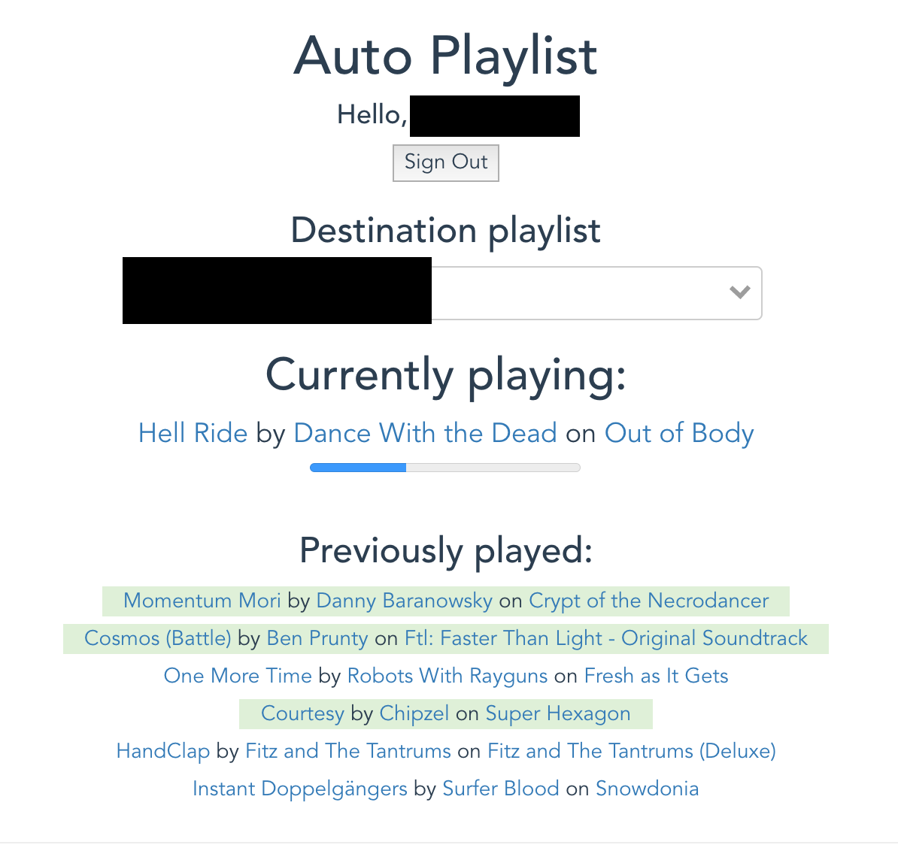

# auto-playlist

> Automatically add songs you finish playing to a Spotify playlist

https://brewingcode.net/auto-playlist

This is a Vue.js app, using short-lived client-side access to the
[Spotify Web API](https://developer.spotify.com/web-api/endpoint-reference/).
The idea is that you leave this web page running in the background, while it
listens to your Spotify plays. Any time you listen to 90% or more of a track,
the page saves that track to a playlist of your choosing.

It looks something like this:



# development

``` bash
# install dependencies
npm install

# serve with hot reload at localhost:8082
npm run dev

# build for production with minification
npm run build-prod

# build for production and view the bundle analyzer report
npm run build --report
```

For detailed explanation on how things work, checkout the [guide](http://vuejs-templates.github.io/webpack/) and [docs for vue-loader](http://vuejs.github.io/vue-loader).
