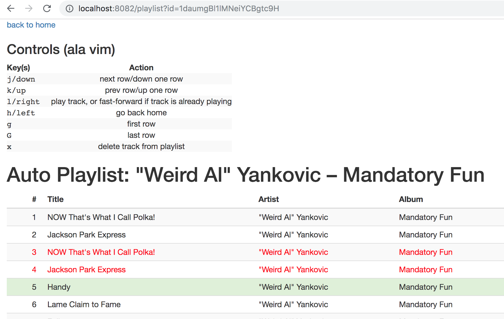

# auto-playlist

> Automatically add songs you finish playing to a Spotify playlist, and easily
remove tracks from any playlist with your keyboard

https://brewingcode.net/auto-playlist

This is a Vue.js app, using short-lived client-side access to the
[Spotify Web API](https://developer.spotify.com/web-api/endpoint-reference/).
The idea is that you leave this web page running in the background, while it
listens to your Spotify plays. Any time you listen to 90% or more of a track,
the page saves that track to a playlist of your choosing.

It looks something like this:


It also provides a playlist editor that is driven by vim-style keybinds to
quickly delete tracks from a playlist, because Spotify's UIs **suck** at doing
that quickly. The track listing also highlights duplicate tracks, because
using the above tool has a tendency to collect duplicate tracks.

It looks like this:



## Project setup
```
yarn
```

### Compiles and hot-reloads for development
```
yarn serve
```

### Compiles and minifies for production
```
yarn build
```

### Customize configuration
See [Configuration Reference](https://cli.vuejs.org/config/).
